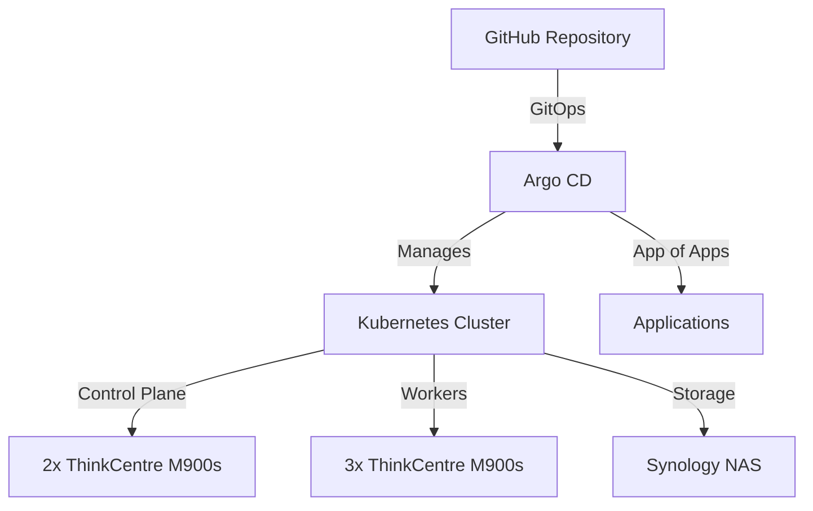

# 🏠 Home Lab Kubernetes Cluster


A fully automated, GitOps-managed Kubernetes cluster running on Lenovo ThinkCentre hardware and Talos Linux.

## 🏗️ Infrastructure Overview

### Hardware
- **Control Plane**: 2x Lenovo ThinkCentre M900s Tiny
- **Workers**: 3x Lenovo ThinkCentre M900s Tiny
- **Storage**: Synology NAS (iSCSI)

### Software Stack
- **Base OS**: Talos Linux
- **Container Orchestration**: Kubernetes
- **GitOps Engine**: Argo CD
- **Storage**: iSCSI-mounted Synology volumes

## 🌟 Key Features

- **GitOps-First Approach**: All cluster configurations and applications are managed through Git using the App of Apps pattern
- **Declarative Configuration**: Everything-as-code philosophy
- **Automated Deployments**: Changes to this repository automatically sync to the cluster via Argo CD
- **Persistent Storage**: Integration with Synology NAS using iSCSI for reliable data persistence

## 🏛️ Architecture



## 📦 Components

- **Cluster OS**: Talos Linux with custom configurations for iSCSI support
- **Networking**: [Your CNI solution]
- **Storage**: iSCSI CSI driver for Synology integration
- **GitOps**: Argo CD with App of Apps pattern

## 🚀 Getting Started

### Prerequisites
- Working knowledge of Kubernetes
- Access to similar hardware or VMs
- Basic understanding of GitOps principles

### Initial Setup
1. Clone this repository
2. Configure your Talos Linux nodes
3. Deploy Argo CD
4. Configure the App of Apps

## 📝 Configuration

The cluster configuration follows the App of Apps pattern, with the following structure:

```
├── apps/
│   ├── argocd/
│   ├── monitoring/
│   ├── storage/
│   └── ...
├── infrastructure/
│   ├── talos/
│   └── storage/
└── manifests/
```

## 🔄 Continuous Deployment

This repository uses Argo CD to automatically sync changes to the cluster. The App of Apps pattern ensures that all applications are managed consistently and can be deployed or updated with minimal manual intervention.

## 🛠️ Maintenance

### Upgrading
- OS updates are handled through Talos Linux machinery
- Application updates are managed through GitOps workflows
- Infrastructure updates follow [your update strategy]

### Backup
- Persistent data is stored on Synology NAS
- [Your backup strategy details]

## 🤝 Contributing

Contributions are welcome! Please feel free to submit a Pull Request.

## 📜 License

[Your chosen license]

---

🔍 **Note**: This is a living document. As the cluster evolves, so will this documentation.
